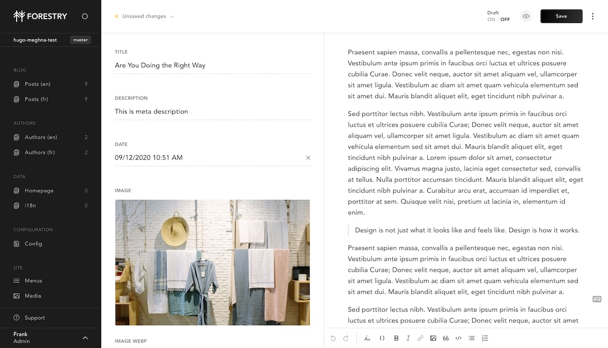

# Hugo Meghna Forestry starter

[Meghna theme](https://github.com/themefisher/meghna-hugo) is developed by Themefisher.


[Live Preview](http://demo.themefisher.com/meghna-hugo/)

## Requirements

- GitHub, GitLab or BitBucket account
- Hugo > 0.58.2 (tested with 0.75.1)

## Content Management

[](https://app.forestry.io/quick-start?repo=forestryio/hugo-meghna-forestry&engine=hugo&version=0.75.1)



This project is pre-configured for [Forestry](https://forestry.io) a Git-based CMS, [import it](https://app.forestry.io/quick-start?repo=forestryio/hugo-meghna-forestry&engine=hugo&version=0.75.1) to edit and preview your site ✨.

Any changes you make in Forestry is commited back to the repository and automatically deployed, when your repository is connected to [Netlify](#netlify).

## Local development

```bash
# clone your imported repository
# cd in the project directory
# Start local dev server
hugo server
```

## Deployment and hosting

### Netlify

[](https://app.netlify.com/start/deploy?repository=https://github.com/forestryio/hugo-meghna-forestry)

1. Set the build command to: `hugo --gc --minify`
2. Set the publish directory to: `public`
3. Make sure to set `HUGO_VERSION` to 0.58.2 or above (tested with 0.75.1)
3. Set the publish directory to: `public`

That's it, now your site gets deployed automatically on `git push` or when saving documents from Forestry.

## Feedback

[Open an issue](https://github.com/themefisher/meghna-hugo/issues) in the theme's repository.

## LICENSE

[CC BY 3.0](LICENSE)
